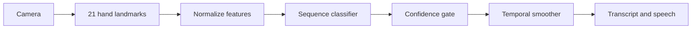

# SignBridge AI

Real-time sign-language recognition with temporal inference, confidence smoothing, an accessibility-first browser UI, and a reproducible TensorFlow/Keras model contract.

  

## Why this is more than a classroom classifier

SignBridge models a sequence, not one still image. It normalizes 21 hand landmarks, extracts motion/shape features, smooths predictions over time, rejects uncertain inputs, and turns stable signs into a transcript.

## Engineering highlights

- Temporal state machine prevents one-frame prediction flicker.
- Confidence and stability gates return `UNKNOWN` instead of misleading users.
- Landmark normalization is invariant to hand position and scale.
- Framework-neutral inference core is fully unit tested; `train.py` defines the Keras production path.
- Accessible UI includes keyboard controls, high contrast, live-region announcements, and a deterministic demo.
- CI tests Python 3.11 and 3.12 on every push.

## Quick start

```bash
python -m unittest discover -s tests -v
python -m http.server 8080 --directory web
```

Open `http://localhost:8080` and choose **Run live demo**. The UI accepts webcam permission and can consume MediaPipe landmarks through `window.onLandmarks(...)`.

## Architecture



`train.py` builds a compact bidirectional GRU when TensorFlow is installed. Dataset records use `(samples, frames, features)` and should be split by signer to prevent identity leakage. Recommended metrics: macro F1, per-class recall, unknown rejection rate, and signer-independent latency.

## Responsible AI

This is an assistive prototype, not a substitute for a qualified interpreter. It does not claim to understand every sign language or dialect. Low-confidence inputs are rejected, and no camera frames are uploaded by the demo.

## Author

Prudhvi Raju Panku — [GitHub](https://github.com/pankuprudhviraju1) · [LinkedIn](https://www.linkedin.com/in/p-prudhvi-raju/)

MIT License.
