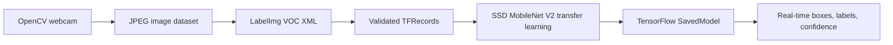

# SignBridge AI — Real-Time Sign Language Object Detection

An end-to-end custom object-detection project inspired by Nicholas Renotte's [TensorFlow sign-language detection tutorial](https://www.youtube.com/watch?v=pDXdlXlaCco). It follows the video's complete workflow—webcam collection, LabelImg bounding boxes, TFRecords, SSD MobileNet transfer learning, checkpoint export, and real-time OpenCV detection—using original, modular code and modern validation.

   

## What it detects

The same five gestures used in the video:

| Class ID | Sign |
|---:|---|
| 1 | `hello` |
| 2 | `thanks` |
| 3 | `yes` |
| 4 | `no` |
| 5 | `iloveyou` |

## Video-to-repository feature map

| Tutorial stage | This repository |
|---|---|
| Collect webcam images with OpenCV | `signbridge/collection/capture_images.py` |
| Label bounding boxes with LabelImg | Pascal VOC folders plus annotation validator |
| Create label map and TFRecords | `prepare_workspace.py` and `generate_tfrecord.py` |
| Configure TensorFlow Object Detection | `configure_pipeline.py` patches SSD MobileNet config |
| Transfer-learn SSD MobileNet | Reproducible `make train` command |
| Export a SavedModel | Reproducible `make export` command |
| Detect signs through webcam | `signbridge/inference/webcam.py` |

## Architecture



## 1. Install

Use Python 3.10 or 3.11; the TensorFlow Object Detection API does not support every newer Python release.

```bash
git clone https://github.com/pankuprudhviraju1/signbridge-ai.git
cd signbridge-ai
python3.11 -m venv .venv
source .venv/bin/activate
pip install -r requirements-dev.txt
```

Install the TensorFlow Models repository and compile its protobuf files using the [official TensorFlow Models installation guide](https://github.com/tensorflow/models/blob/master/research/object_detection/g3doc/tf2.md). Clone it under `Tensorflow/models` so the Makefile paths work.

```bash
git clone --depth 1 https://github.com/tensorflow/models Tensorflow/models
cd Tensorflow/models/research
protoc object_detection/protos/*.proto --python_out=.
cp object_detection/packages/tf2/setup.py .
pip install .
cd ../../..
python -c "from object_detection.utils import label_map_util; print('Object Detection API ready')"
```

## 2. Collect images

The tutorial uses 15 images per class. This command reproduces that balanced collection loop, including countdowns and two-second pose intervals:

```bash
make collect
python -m signbridge.collection.capture_images --split test --images-per-label 4 --interval 1
```

Press `q` to stop. Images land under `Tensorflow/workspace/images/{train,test}` with collision-safe UTC filenames.

## 3. Label with LabelImg

```bash
pip install labelImg
labelImg Tensorflow/workspace/images/train Tensorflow/workspace/annotations/label_map.pbtxt
```

Choose **PascalVOC**, draw one tight box around each signing hand, and use only the five labels above. Repeat for `test`, then validate:

```bash
python -m signbridge.training.prepare_workspace --validate
```

## 4. Download and configure SSD MobileNet

Download `ssd_mobilenet_v2_fpnlite_320x320_coco17_tpu-8` from the [TensorFlow 2 Detection Model Zoo](https://github.com/tensorflow/models/blob/master/research/object_detection/g3doc/tf2_detection_zoo.md), extract it into `Tensorflow/workspace/pre-trained-models`, and run:

```bash
python -m signbridge.training.configure_pipeline \
  Tensorflow/workspace/pre-trained-models/ssd_mobilenet_v2_fpnlite_320x320_coco17_tpu-8/pipeline.config \
  --checkpoint Tensorflow/workspace/pre-trained-models/ssd_mobilenet_v2_fpnlite_320x320_coco17_tpu-8/checkpoint/ckpt-0
```

The configurator sets five classes, detection fine-tuning, label-map paths, and train/test TFRecord inputs.

## 5. Train, evaluate, export

```bash
make records
make train

python Tensorflow/models/research/object_detection/model_main_tf2.py \
  --model_dir=Tensorflow/workspace/models/signbridge_ssd_mobilenet \
  --pipeline_config_path=Tensorflow/workspace/models/signbridge_ssd_mobilenet/pipeline.config \
  --checkpoint_dir=Tensorflow/workspace/models/signbridge_ssd_mobilenet

make export
```

Do not judge the model only by training loss. Review evaluation loss, per-class precision/recall, varied lighting/backgrounds, and false positives on hands that are not signing.

## 6. Real-time detection

```bash
make detect
# Optional confidence threshold:
python -m signbridge.inference.webcam --threshold 0.70
```

The camera view renders each bounding box, sign name, and confidence score. Press `q` to exit.

## Repository layout

```text
signbridge/                    Original collection, training, and inference modules
Tensorflow/workspace/images/  Local train/test images and LabelImg XML
Tensorflow/workspace/annotations/ Label map and generated TFRecords
Tensorflow/workspace/models/  Training checkpoints and pipeline config
Tensorflow/workspace/exported-models/ Exported SavedModel
fixtures/                     Synthetic annotation used by tests
tests/                        Dataset/configuration unit tests
web/                          Zero-install portfolio preview
```

Large datasets, checkpoints, and exported models are intentionally Git-ignored. This avoids pretending that untrained weights are production artifacts and keeps the repository reproducible. Add your own consented images; do not publish people's images without permission.

## Improvements beyond the tutorial

- Modules and CLI commands instead of notebook-only state
- Annotation integrity checks before expensive training
- Deterministic label IDs and pipeline configuration
- Security-conscious, privacy-first dataset policy
- Automated tests and GitHub Actions
- Responsive no-install preview for recruiters

## Responsible use

This is a five-gesture assistive prototype, not a complete sign-language translator or a substitute for a qualified interpreter. Sign languages have grammar and regional variation. Low-confidence predictions should be ignored, and all training participants must consent to image capture.

## Author

Prudhvi Raju Panku — [GitHub](https://github.com/pankuprudhviraju1) · [LinkedIn](https://www.linkedin.com/in/p-prudhvi-raju/)

MIT License. The linked video and its original repository belong to their respective creator; this implementation is independently written.
